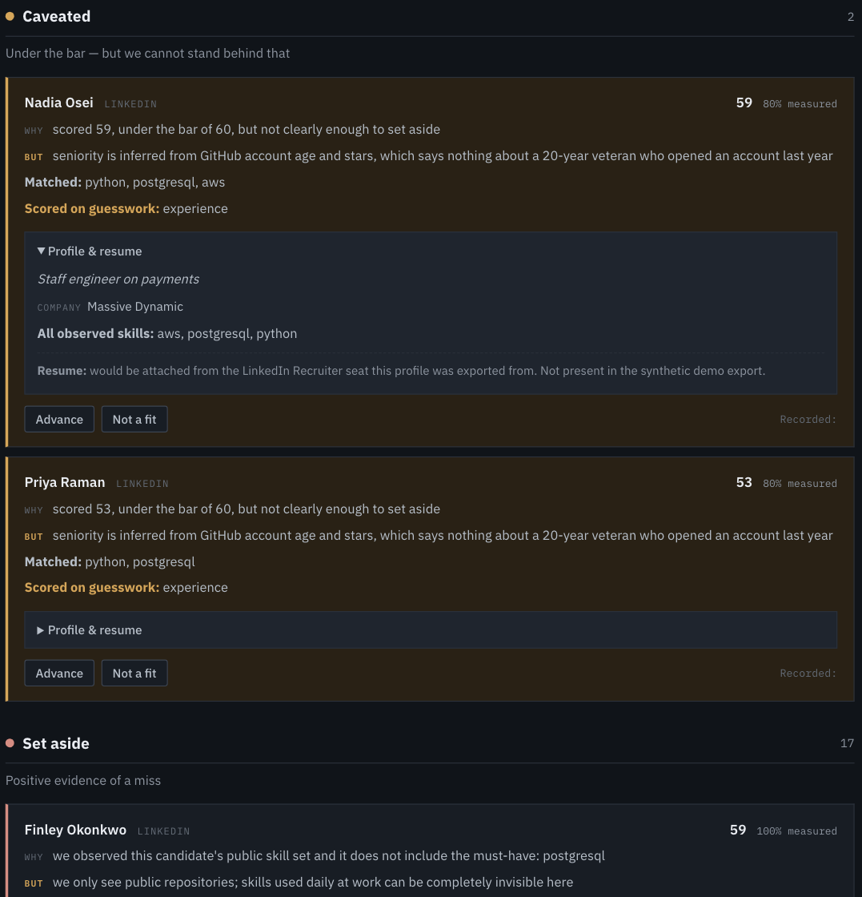

# Candidate Sourcing Scorecard

A sourcing triage tool built on one rule: a candidate is only ever set aside
on positive evidence of a miss, never on missing evidence.

## How it works

Every scoring category carries its value plus an observed/imputed flag
([`evidence.py`](src/sourcing/evidence.py)). Confidence is the share of
scoring weight backed by real observation rather than inference.

Candidates land in four tiers instead of above or below a line
([`triage.py`](src/sourcing/triage.py)):

| Tier | Meaning |
|---|---|
| Strong | Clears the bar on measured evidence |
| Review | Over the bar, but partly on guesswork |
| Caveated | Under the bar, but only on signals never observed. Never auto-removed. |
| Set aside | The relevant signal was observed and came up short |

Only the last leaves the queue, and those are still listed with their
reasoning so you can overrule them.



Both score 59 against a bar of 60. Nadia is 80% measured: the missing fifth
is experience, inferred from GitHub account age, which says nothing about a
veteran who made an account last year, so she stays. Finley is 100% measured:
the skill set was visible and PostgreSQL wasn't in it. Same score, different
amounts of knowledge, and a binary cuts both.

## Running it

```bash
python3 -m venv .venv && source .venv/bin/activate
pip install -r requirements.txt && pip install -e .

export GITHUB_TOKEN=...   # optional; any token, no scopes needed
```

```bash
python -m sourcing.cli \
  --req reqs/example-backend-engineer.yaml \
  --linkedin-csv data/fake_linkedin_candidates.csv \
  --out out/candidates.csv --review-out out/review.md
```

`--skip-github` gives a fully offline deterministic run on the demo data — 26
candidates, 10 kept, 16 set aside.

```bash
pytest -q     # 107 tests
```

## Measuring whether it works

Verdicts are recorded separately from scoring, and metrics come only from
recorded decisions ([`feedback.py`](src/sourcing/feedback.py)). An empty log
reports "no decisions yet" rather than a made-up number.

The headline metric isn't precision — you can ace precision by advancing
almost nobody. It's **missed rate**: of the candidates set aside, how many did
the recruiter actually want. That's the false-negative rate on the tool's own
discard pile, and it's the only number that gets worse as the tool gets
overconfident.

Feedback drives recalibration proposals
([`calibration.py`](src/sourcing/calibration.py)) but never applies them
automatically. A model that silently re-weights itself is how you get a bias
nobody can point at.

## Integrations

GitHub repository and topic search is live. There's a LinkedIn Recruiter
seat-export connector that tracks provenance and staleness, and an
[Ashby ATS adapter](src/sourcing/integrations/ashby.py) built against the real
API — no tenant behind this repo, so it dry-runs by default.

The Ashby adapter never rejects anyone in the ATS. Set-aside candidates are
still pushed, tagged, with the reasoning in a note. A rejection in the system
of record is where an automated call becomes irreversible, so the tool's
opinion travels with the candidate but the decision doesn't.

`.github/workflows/watch.yml` re-scores weekly, diffs against the last
snapshot, and opens an issue when the pool shifts.

## Scoring rubric

0–100 across five weighted categories. Full detail in
[`SCORING.md`](SCORING.md).

| Category | Weight | Measures |
|---|---|---|
| Skill match | 40 | Overlap with the req's `required_skills` |
| Experience | 20 | Seniority vs `min_years_experience` |
| Recency | 20 | Active and reachable now |
| Location | 10 | Matches `location`, or 1.0 when `remote_ok` |
| Corroboration | 10 | Bonus for appearing in more than one source |

## Known limits

- Discovery favours people who build in public, so engineers under strict IP
  policies are harder to surface. Triage can't fix that — you can't caveat
  someone you never found.
- 16 of 26 in the demo run land in "set aside". Defensible, but that pile is
  worth reading.
- No LLM, deliberately ([`escalation.py`](src/sourcing/escalation.py)).
  Designed and priced, left off for now. If enabled it could only move someone
  *up* a tier, since model output isn't the positive evidence the discard rule
  requires.
- This is triage for building an outreach list, not a compliance or EEO tool,
  and not a basis for hiring decisions.
