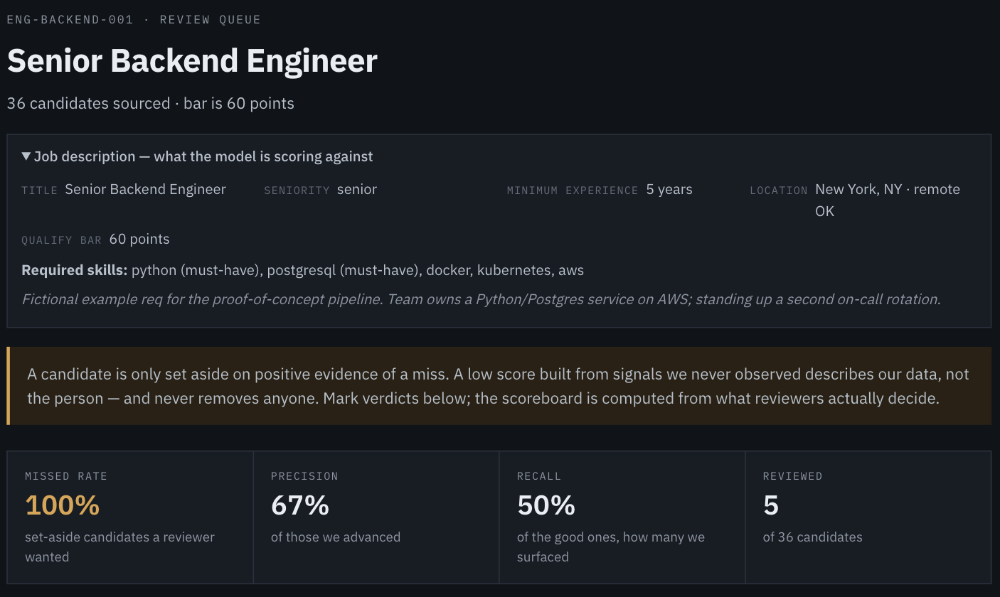

# Candidate Sourcing Scorecard

A sourcing tool built on one core rule: **it is inexcusable to discard the dream
candidate.** Everything below follows from that.

---

## 1. The problem

Most automated screening tools spit out a binary output. Above the line you exist; below it you were never there. Nobody
sees who got cut, and nothing records why.

That is tolerable when the score is right. The trouble is that a score built from data you don't have looks exactly like a score built from data you do.

Screening errors are also wildly asymmetric, and threshold tools treat them as
if they weren't:

| | Cost |
|---|---|
| **False positive** — a mediocre candidate reaches a human | ~30 seconds of a recruiter's time |
| **False negative** — the right person is silently removed | The hire that never happened. Nobody ever learns it went wrong. |
---

## 2. The fix

### Make "did we measure this?" a first-class fact

Every category now carries its value **and** whether that value was observed
([`evidence.py`](src/sourcing/evidence.py)). **Confidence** is the share of
scoring weight backed by real observation.

### One hard rule

> A candidate may only be set aside on **positive evidence of a miss**, never
> on the absence of evidence.

Absence of evidence about a person is a fact about our data collection. It is
not a fact about them.

### Four tiers, not a cut

([`triage.py`](src/sourcing/triage.py))

| Tier | Meaning |
|---|---|
| **Strong** | Clears the bar on measured evidence |
| **Review** | Over the bar, but partly on guesswork, or missing a must-have |
| **Caveated** | Under the bar — **but the weakness rests on signals we never observed.** Never auto-removed. Always carries the reason *and* the reason that reason may be wrong. |
| **Set aside** | We observed the relevant signal and it genuinely came up short |

Only the last is removed from the queue, and every set-aside candidate is
listed in full with its reasoning so the judgement can be audited and
overruled.

### It says why it might be wrong

Each caveat names a specific, documented failure mode — not a hedge:

> *"a quiet public profile can mean private-repo work, a career break,
> parental leave, or simply not coding in public"*


**This is the entire argument in one screenshot.** Two candidates, both scoring
**59** against a bar of 60.

- **Nadia Osei** — 80% measured. The missing 20% is *experience*, and the
  caveat says exactly why that matters: seniority is inferred from GitHub
  account age, which says nothing about a veteran who opened an account last
  year. She stays in the queue.
- **Finley Okonkwo** — 100% measured. We observed the skill set and PostgreSQL
  genuinely isn't in it. That is evidence, so this one is set aside — and even
  then the caveat still runs, because public repos hide the skills people use
  at work.

Identical scores. Different amounts of *knowledge*. A binary system could not
tell them apart and cut both.

### Try it

```bash
python -m sourcing.cli \
  --req reqs/example-backend-engineer.yaml \
  --linkedin-csv data/fake_linkedin_candidates.csv \
  --out out/candidates.csv \
  --review-out out/review.md
```

There is also a **[working review-queue UI](https://claude.ai/code/artifact/f7ef6f6f-671f-444b-9d7e-d17ff3608233)** —
job description, per-candidate profile detail, and Advance / Not-a-fit
verdicts that persist and sync between viewers.



*The scoreboard is computed from recorded verdicts. Before anyone decides
anything it reads "no decisions yet" rather than a number — here it is showing
five real verdicts. **Missed rate leads** because it is the number that gets
worse when the tool becomes overconfident.*

---

## 4. Measuring whether it works

A screening tool that can't be checked is just an opinion with a number on it.
([`feedback.py`](src/sourcing/feedback.py))

Every recruiter verdict is recorded, and the metrics are computed **only from
recorded decisions**. With an empty log the dashboard says *"no decisions
yet"* rather than a plausible-looking percentage.

The headline metric is deliberately **not** precision. Precision asks "of the
people we advanced, how many were good" — a question you can ace by advancing
almost nobody. Given the philosophy, the number that matters is its inverse:

```
missed_rate = of the candidates we set aside,
              how many did the recruiter say were actually good?
```

That is the false-negative rate on our own discard pile, and it is the only
metric that gets *worse* when the tool becomes overconfident.

Feedback also drives real recalibration ([`calibration.py`](src/sourcing/calibration.py)):
repeated "not senior enough" rejections on candidates we advanced means the
experience signal is reading high, and the tool proposes a weight cut with the
evidence attached. **Proposals are never auto-applied** — a screening model
that silently re-weights itself is how a hiring tool acquires a bias nobody
can point at.

---

## 5. Integrations

| Integration | Status |
|---|---|
| **GitHub** | Live. Repository/topic search — see the caveat below. |
| **LinkedIn Recruiter** ([`linkedin_recruiter.py`](src/sourcing/integrations/linkedin_recruiter.py)) | Seat-export connector with provenance and staleness handling |
| **Ashby ATS** ([`ashby.py`](src/sourcing/integrations/ashby.py)) | Built against Ashby's real API; no tenant behind this repo, so `--dry-run` shows exact payloads |

The Ashby adapter has one rule baked in: **it never rejects anyone in the
ATS.** Set-aside candidates are still pushed, tagged
`scorecard:caveated-do-not-cut`, and annotated with the full reasoning —
because pushing a rejection into the system of record is the moment an
automated judgement becomes irreversible. The tool's opinion travels with the
candidate; the decision does not.

---

## 6. It runs itself

`.github/workflows/watch.yml` re-runs sourcing weekly, diffs against the last
snapshot in `data/snapshots/`, commits the new state, and opens a GitHub Issue
when the pool changes. Cron, `workflow_dispatch`, and `repository_dispatch`
triggers; entirely on the free tier.

---

## 7. Caveats — the choices I made, and why

**Discovery is biased toward people who build in public.** Repository search
finds candidates by what they ship. Engineers under strict IP policies are
systematically harder to find — and this is a *discovery* bias the triage layer
cannot repair, because you can't caveat someone you never surfaced.

**"Set aside" is still a judgement, and it can be wrong.** 17 of 36 candidates
in the demo run land there. The tier is defensible — observed skills, genuine
missing must-have — but the discard pile deserves reading.

**Corroboration used to be a hidden penalty.** SCORING.md called it "not a
penalty, just no bonus", but on a 100-point scale with a 60-point bar, scoring
0 functions as a 10-point penalty for only existing on GitHub. It's now
excluded from counting as a measured weakness.

**The demo LinkedIn export is fictional, and was too clean.** Every scored
field was populated, which meant the Caveated tier could never fire — the exact
behaviour the tool exists for was untestable. Sparse rows were added, because
real exports have gaps.

**No LLM, deliberately** ([`escalation.py`](src/sourcing/escalation.py)).
Designed and priced, switched off. The escalation queue would be the
**Caveated tier alone** — that tier *is* the ambiguity, so LLM spend would land
only where judgement is genuinely required rather than scaling with pool size.
If enabled, an LLM could only ever move a candidate *up* a tier; model output
is not the "positive evidence of a miss" the discard rule requires.

**Not a compliance or EEO tool.** Treat the ranking as a triage aid for
building an outreach list, never as the basis for a hiring decision.

---

## Scoring rubric

0–100 across five weighted categories. Full rubric in
[`SCORING.md`](SCORING.md); a second, experimental three-axis pass in
[`EXPERIMENTAL_SCORING.md`](EXPERIMENTAL_SCORING.md). Both now produce tiers
rather than a binary.

| Category | Weight | Measures |
|---|---|---|
| Skill match | 40 | Overlap with the req's `required_skills` |
| Experience | 20 | Seniority vs `min_years_experience` |
| Recency | 20 | Active and reachable now |
| Location | 10 | Matches `location`, or 1.0 when `remote_ok` |
| Corroboration | 10 | Bonus for appearing in more than one source |

```bash
pytest -q     # 95 tests
```
