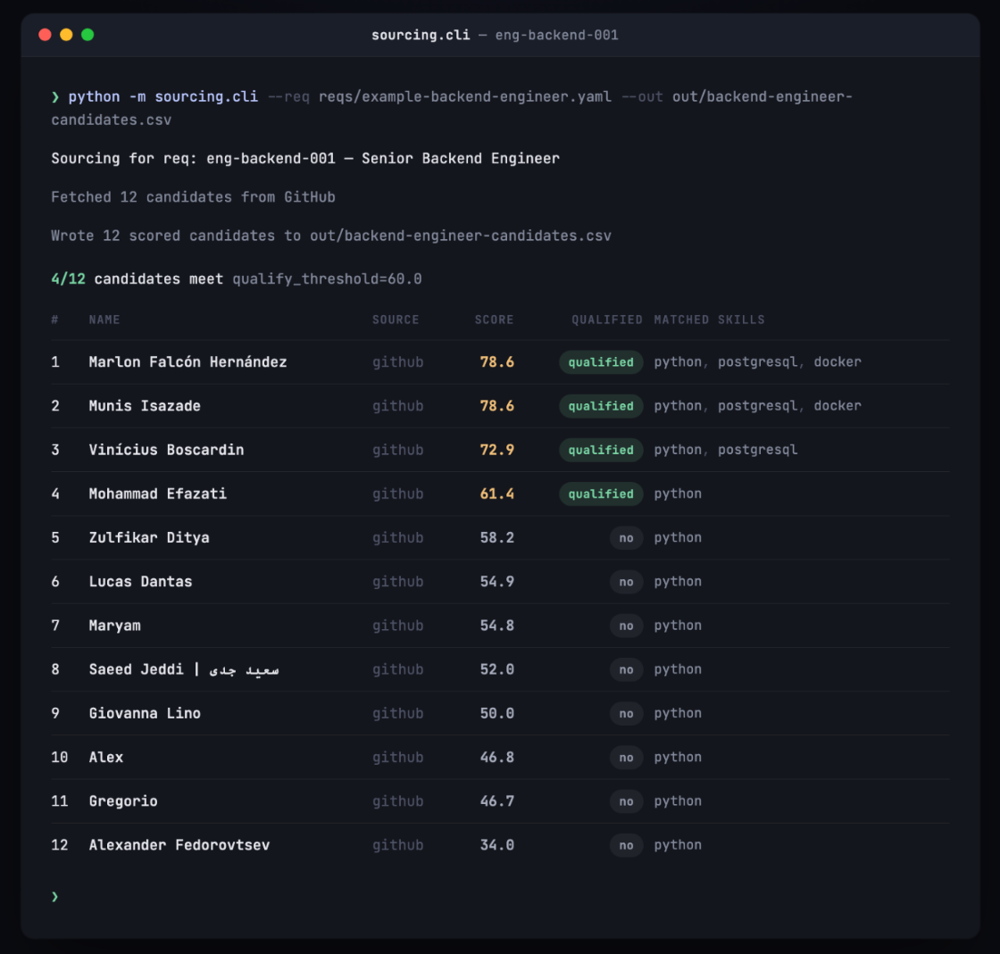

# Candidate Sourcing Scorecard

A small, transparent tool that takes an open req (job requisition) and produces
a **ranked, scored candidate list** from public signals — with every score
broken down so a human can see exactly why a candidate ranked where they did.

**Status: proof of concept.** Live GitHub data, synthetic LinkedIn data (see
below). Not connected to any real ATS or real LinkedIn account.



*A real run against `reqs/example-backend-engineer.yaml` — 12 live GitHub
candidates, 4 meeting the qualify threshold. (Redrawn from the actual
`sourcing.cli` console output for readability; every name, score, and skill
match here is real.)*

## Why it's built this way

- **Cheap/free**: GitHub's Search + REST API is free at the tier this needs
  (5,000 authenticated requests/hour). No paid data vendor, no scraping
  infrastructure.
- **Defensible**: GitHub data is pulled through GitHub's own public API,
  within its rate limits and terms of service — nothing here scrapes GitHub's
  website. LinkedIn does **not** offer a public search API, and scraping it
  violates LinkedIn's Terms of Service (and carries real legal risk — see
  *hiQ Labs v. LinkedIn* for how contested this is even for "public" data).
  So this project **never scrapes LinkedIn**. The LinkedIn path is a CSV
  importer: in real use, that CSV is a manual export from a LinkedIn
  Recruiter/Sales Navigator seat the requester is already licensed to use.
  Since this proof of concept was built without such a seat, the included
  `data/fake_linkedin_candidates.csv` is 100% invented — fictional names at
  fictional companies (Acme Corp, Globex, Initech, Hooli...) — used only to
  demonstrate the ingestion and scoring code path.
- **Scalable**: sources are pluggable (`src/sourcing/*_source.py`), scoring
  is a pure function over a common `Candidate` shape, and reqs are just YAML
  files — add a req, run the CLI, get a ranked CSV.
- **Well documented**: the full scoring rubric — the actual definition of
  "qualified" used here — lives in [`SCORING.md`](SCORING.md), not buried in
  code.

## Quickstart

```bash
python3 -m venv .venv && source .venv/bin/activate
pip install -r requirements.txt
pip install -e .   # installs the `sourcing` package so `python -m sourcing.cli` resolves

cp .env.example .env
# edit .env and set GITHUB_TOKEN (a classic PAT with no scopes needed for
# public search is fine: https://github.com/settings/tokens)
export GITHUB_TOKEN=...   # or pass --github-token directly

python -m sourcing.cli \
  --req reqs/example-backend-engineer.yaml \
  --linkedin-csv data/fake_linkedin_candidates.csv \
  --out out/backend-engineer-candidates.csv
```

This prints a ranked table to the console and writes the full scorecard
(every candidate, every sub-score, every reason) to the `--out` CSV.

## Two scoring passes, on purpose

This repo has **two independent scorers** you can run against the same req
and candidates:

- `sourcing.cli` / `SCORING.md` — the **traditional pass**: one blended
  0–100 score per candidate.
- `sourcing.cli_experimental` / `EXPERIMENTAL_SCORING.md` — the
  **experimental pass**: three separate axes (Foundation / Bonus /
  Momentum) instead of one number, and fixes a real bias in the
  traditional pass — it no longer penalizes candidates for not already
  being local (an unstated assumption they wouldn't relocate) or for a
  quiet GitHub profile (which might just mean private-repo work or a
  career break).

They're kept as separate code paths deliberately, writing to separate
output files, so you can compare them:

```bash
python -m sourcing.cli \
  --req reqs/example-onsite-backend-engineer.yaml \
  --linkedin-csv data/fake_linkedin_candidates.csv \
  --out out/onsite-traditional.csv

python -m sourcing.cli_experimental \
  --req reqs/example-onsite-backend-engineer.yaml \
  --linkedin-csv data/fake_linkedin_candidates.csv \
  --out out/onsite-experimental.csv

python -m sourcing.compare_passes \
  --traditional-csv out/onsite-traditional.csv \
  --experimental-csv out/onsite-experimental.csv \
  --out out/onsite-comparison.csv
```

`compare_passes` reports rank movement and any `qualified` status flips
between the two passes — that's where the two models disagree, and it's
worth reading by hand. `reqs/example-onsite-backend-engineer.yaml` exists
specifically to exercise this: it's not `remote_ok`, so it's the case
where the traditional pass's location penalty actually fires.

## Watch mode: this runs itself

Everything above is one-shot: you run it, you get a CSV. `sourcing.watch` is
the same pipeline wired to a scheduler, with state, so the repo tracks a req's
candidate pool over time instead of forgetting it the moment the command
exits.

```bash
python -m sourcing.watch \
  --req reqs/example-backend-engineer.yaml \
  --report-out out/watch-report.md
```

Each run:

1. Gathers and scores candidates exactly like `sourcing.cli` (same shared
   pipeline, `src/sourcing/pipeline.py` — they can't drift apart).
2. Loads the last snapshot for this req from `data/snapshots/<req_id>/latest.json`.
3. Diffs the two: new candidates, `qualified` flips in either direction,
   candidates whose score moved by ≥5 points, and candidates that dropped
   out of the results entirely.
4. Writes the new snapshot back and a markdown report of what changed.

`.github/workflows/watch.yml` schedules this for real, with zero paid
infrastructure:

- Runs weekly (`workflow_dispatch` for on-demand, `repository_dispatch` so an
  external webhook can trigger a re-scan too) via GitHub Actions' free tier.
- Loops over every req in `reqs/*.yaml`.
- Commits the updated snapshots back to the repo — `git log data/snapshots/`
  is the audit trail.
- When something actually changed, opens (or comments on) a GitHub Issue
  titled `Candidate pool watch: <req_id>` with the diff — that's the part a
  human doesn't have to remember to check for.
- A req that finds zero candidates in a given run (a narrow query is a
  normal, expected outcome of GitHub's free-text user search, not a fault)
  is logged as a warning and skipped, not treated as a failed run.

This is the difference between "a script that makes a CSV" and a small
pipeline: it has memory (the snapshots), a trigger it doesn't need a human to
press (cron + webhook), and it takes action on what it finds (the Issue) —
all inside GitHub's free tier.

## Project layout

```
reqs/                    Open req definitions (YAML) — what "this job needs" means
data/                    Synthetic demo data (fake LinkedIn export)
data/snapshots/          Watch mode's state: one JSON snapshot per req, per run
.github/workflows/
  ci.yml                 Runs the test suite on every push/PR
  watch.yml              Scheduled/webhook-triggered watch run (see "Watch mode" above)
src/sourcing/
  config.py              Loads/validates a req YAML into a Req object
  candidate.py           The common Candidate shape both sources normalize into
  github_source.py       Live GitHub Search API -> candidates
  linkedin_source.py     CSV -> candidates (real export or synthetic demo file)
  scoring.py             Traditional pass: Candidate + Req -> one blended score
  scoring_experimental.py  Experimental pass: Candidate + Req -> 3 axis scores
  pipeline.py            Shared gather-and-score pipeline used by cli.py and watch.py
  store.py               Watch mode's snapshot persistence + diffing
  cli.py                 Traditional pass entry point, writes ranked CSV
  cli_experimental.py    Experimental pass entry point, writes ranked CSV
  compare_passes.py      Diffs a traditional-pass CSV against an experimental one
  watch.py               Scheduled entry point: score, diff vs. last snapshot, report
tests/                   Unit tests (scoring is fully unit-testable, no network)
SCORING.md               Traditional pass: the definition of "qualified", spelled out
EXPERIMENTAL_SCORING.md  Experimental pass: the 3-axis model, spelled out
```

## Writing a real req

Copy `reqs/example-backend-engineer.yaml` and edit the fields — see comments
in that file. No code changes needed to source a new req.

## Using real data instead of the demo

- **GitHub**: already real and live — just set `GITHUB_TOKEN` and run it.
  Respect GitHub's rate limits (the client backs off automatically on 403s).
- **LinkedIn**: replace `data/fake_linkedin_candidates.csv` with an export
  from your own LinkedIn Recruiter/Sales Navigator seat, matching the same
  column headers (see `src/sourcing/linkedin_source.py` docstring). Do not
  point this at scraped data — that's explicitly the one thing this project
  is designed to avoid.

## Limitations (read before trusting the output)

- GitHub activity is a proxy for skill, not proof of it — it's biased toward
  candidates who work in the open (open source, public side projects) and
  against people who do all their work in private repos.
- The scoring weights in `SCORING.md` are a starting point, not a validated
  model. Tune them per role and sanity-check against a few candidates you
  already know.
- This is not a compliance/EEO tool. Don't use the score as the sole basis
  for a hiring decision — it's a triage aid for building an outreach list.
- GitHub's `search/users` free-text terms are AND'd against a user's
  login/bio, so a req with several required skills can produce a genuinely
  narrow query and return few or zero results some runs — that's a search
  limitation, not a pipeline error (see "Watch mode" above for how the
  scheduled run handles it).
